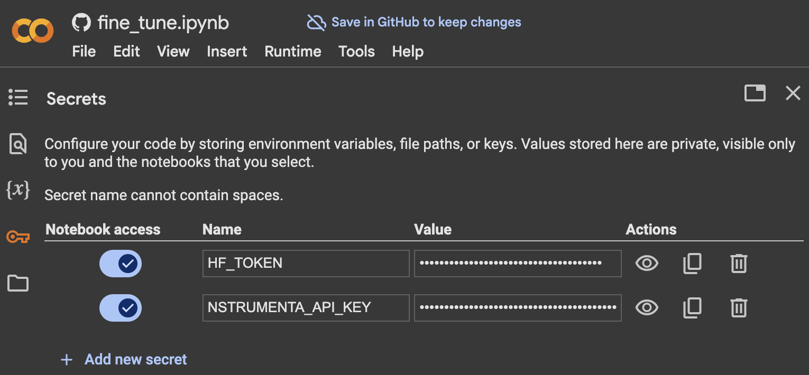
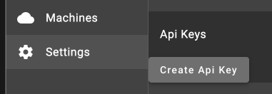

# time-series-classifier
Repository containing colab notebooks for AI development

## Overview
This repository contains scripts and notebooks for developing and fine-tuning AI models, specifically for audio classification tasks. It includes tools for synthetic data generation, time-series classification, and model fine-tuning.

## Directory Structure

```
/workspaces/time-series-classifier/
├── src/
│   ├── synthetic/                    # Core synthetic data generation
│   │   ├── __init__.py              # Module exports
│   │   ├── generator.py             # SyntheticDataGenerator class
│   │   └── math_utils.py            # Math utilities (quaternions, vectors, etc.)
│   ├── mcap_utils/                  # MCAP processing utilities  
│   │   ├── __init__.py              # Module exports
│   │   ├── reader.py                # Data reading functions
│   │   ├── visualization.py         # Plotting and visualization
│   │   ├── dataset.py               # ML dataset creation
│   │   └── spectrogram.py           # Spectrogram processing
│   └── mcap_utilities.py            # Original monolithic file (kept for compatibility)
├── config/
│   └── default_plan.json            # Default configuration for synthetic data generation
├── scripts/
│   ├── script_utils.py              # Common utilities for all scripts
│   ├── generate_synthetic.py        # CLI for synthetic data generation
│   ├── classify.py                  # Classification script
│   ├── fine_tune.py                 # Fine-tuning script
│   └── synthetic_data.py            # Data processing script
├── examples/
│   └── basic_example.py             # Usage demonstration
├── tests/
│   └── test_synthetic.py            # Test suite
└── docs/
    └── synthetic_data.md             # Documentation
```

## Scripts

All scripts use common utilities from `script_utils.py` for consistent environment setup, file management, and Nstrumenta integration.

### script_utils.py
Provides common functions for all scripts:
- `init_script_environment()` - Sets up Python path and Nstrumenta client
- `setup_working_directory()` - Creates and manages working directories
- `fetch_nstrumenta_file()` - Downloads files from Nstrumenta with optional extraction
- `upload_with_prefix()` - Uploads files with organized remote paths

### generate_synthetic.py
Command-line interface for generating synthetic sensor data from motion plans.

### fine_tune.py
The `fine_tune.py` script is used to fine_tune a pre-trained audio classification model on a custom dataset. The script performs the following steps:
1. **Setup and Initialization**: Initializes the working directory and sets up the environment.
2. **Data Preparation**: Downloads necessary input files and creates spectrograms from time-series data.
3. **Dataset Creation**: Creates a dataset from the spectrogram files and corresponding labels.
4. **Model Configuration**: Loads a pre-trained model and updates its configuration based on the dataset labels.
5. **Training**: Splits the dataset into training and testing subsets, and trains the model using the `Trainer` class from the `transformers` library.
6. **Evaluation**: Evaluates the model on the test set and logs the metrics.
7. **Model Saving**: Saves the trained model and uploads it to the Nstrumenta platform.

### classify.py
The `classify.py` script is used to classify time-series data using a fine_tuned model. The script performs the following steps:
1. **Setup and Initialization**: Initializes the working directory and sets up the environment.
2. **Data Preparation**: Downloads necessary input files and creates spectrograms from time-series data if they do not already exist.
3. **Model Loading**: Loads the fine_tuned model for time-series classification.
4. **Spectrogram Classification**: Classifies the spectrogram data using the loaded model.
5. **Result Upload**: Uploads the classification results to the Nstrumenta platform.

## Usage

### Synthetic Data Generation

#### Command Line
```bash
python scripts/generate_synthetic.py --plan config/default_plan.json --output data.mcap
```

#### Python API
```python
from synthetic import SyntheticDataGenerator
generator = SyntheticDataGenerator()
generator.generate("config/default_plan.json", "output.mcap")
```

### Data Analysis
```python
from mcap_utils import read_synthetic_sensor_data, plot_synthetic_sensor_data
data = read_synthetic_sensor_data("output.mcap")
plot_synthetic_sensor_data("output.mcap")
```

### Machine Learning Dataset Creation
```python
from mcap_utils import extract_imu_windows
windows = extract_imu_windows("output.mcap", window_size_ns=1e9)
```

### Using in Colab
classify: [](https://colab.research.google.com/github/nstrumenta/time-series-classifier/blob/main/notebooks/classify.ipynb)

fine_tune: [](https://colab.research.google.com/github/nstrumenta/time-series-classifier/blob/main/notebooks/fine_tune.ipynb)

## Experiment File Example

Experiment files define datasets for training and classification. Here's an example from our synthetic magnetic distortion data:

```json
{
  "dirname": "synthetic_datasets/training_sequence_0",
  "labelFiles": [
    {
      "filePath": "projects/nst-test/data/synthetic_datasets/training_sequence_0/training_sequence_0.labels.json"
    }
  ],
  "description": "Synthetic dataset: training_sequence_0",
  "segments": [
    {
      "name": "high_motion_0",
      "duration_s": 6.942836128288839,
      "rotation_rpy_degrees": {
        "roll": 1.5799431492871534,
        "pitch": -6.920307915411698,
        "yaw": -77.28209866177114
      },
      "magnetic_distortion": 2.115377702012322,
      "mag_distortion": {
        "level": "high"
      }
    },
    {
      "name": "none_motion_1", 
      "duration_s": 18.26988031964769,
      "rotation_rpy_degrees": {
        "roll": 18.08781247960689,
        "pitch": 6.5994098443636915,
        "yaw": 81.38743907152028
      },
      "magnetic_distortion": 0.0,
      "mag_distortion": {
        "level": "none"
      }
    }
  ],
  "metadata": {
    "generated_by": "synthetic_data.py",
    "sample_rate": 100,
    "total_duration_s": 600.6333273280001,
    "classification_type": "mag_distortion",
    "distortion_levels": ["none", "high", "low"]
  }
}
```

**Key Fields:**
- `dirname`: Points to the directory containing the MCAP data files
- `labelFiles`: Array of label files with classification data  
- `description`: Human-readable description of the dataset
- `segments`: Detailed information about each data segment including motion parameters and distortion levels
- `metadata`: Additional information about data generation and classification schema

**Magnetic Distortion Levels:**
- `none` (0): No magnetic distortion applied
- `low` (1): Low-level magnetic field distortion  
- `high` (2): High-level magnetic field distortion


## set up secrets


### NSTRUMENTA_API_KEY
Use an nstrumenta API key from your project:



### HF_TOKEN

Use an access token from Hugging Face settings:

https://huggingface.co/docs/hub/en/security-tokens 


### Fine-Tuning a Model
To fine_tune a model, run the `fine_tune.py` script:
```sh
python scripts/fine_tune.py